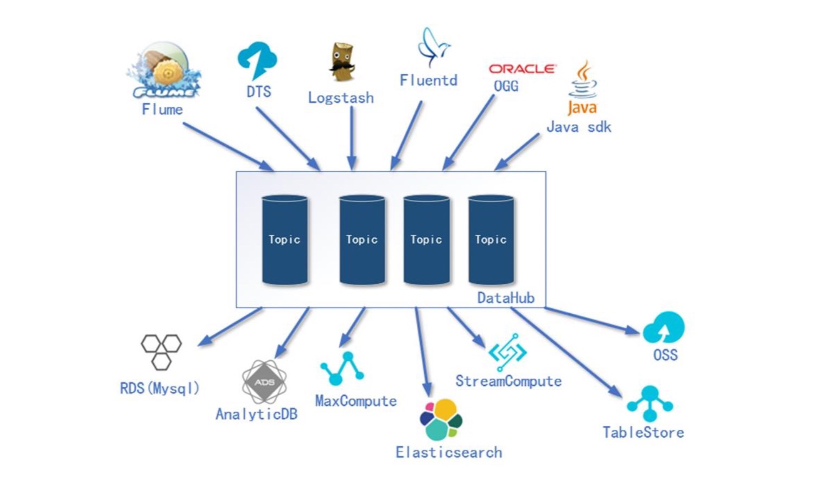

尚硅谷实时数据仓库项目(阿里云实时数仓)
地址：[https://www.bilibili.com/video/BV1dJ411k7BE?p=1](https://www.bilibili.com/video/BV1dJ411k7BE?p=1)
# 第1章 项目需求及架构设计
## 1.1 项目需求分析
* 实时采集埋点日志数据
* 实时采集业务数据库中数据
* 对数据进行清洗和处理
* 保存数据到分析型数据库
* 对结果进行可视化展示

## 1.2 项目框架 
### 1.2.1 阿里云技术框架
* 阿里云产品->简介->类比
* ECS->弹性服务器->Linux服务器
* RDS->关系型数据库->Mysql
* DataHub->数据总线->Kafka+各种服务接口
* 实时计算->实时计算->Spark、Flink
* DataWorks（Stream Studio）->可视化StreamCompute的开发管理平台->目前没有
* AnalyticDB for Mysql->分析型数据库->Mysql集群
* DataV->可视化数据展示工具->Tableau、Echarts、Kibana
### 1.2.2 技术选型
* 阿里云框架->开源框架
* 数据采集传输：DataHub、DTS->Flume、Kafka、Canal、MaxWell
* 数据存储：RDS、AnalyticDB->Mysql、Hadoop、HBase
* 数据计算：实时计算->Spark、Flink
* 数据可视化：DataV、QuickBI->Tableau、Echarts、Kibana
### 1.2.3 系统架构设计

* 埋点用户行为数据以文件形式存储，采用Flume读取并写入到DataHub
* RDS业务数据以mysql形式存储，分为DTS（同步事实表）和DTS（同步维表）
* DTS（同步事实表）数据同步到DataHub中，数据特点：需要初步加工进行join操作
* DTS（同步维表）数据同步到维表库RDS中，数据特点：不需要加工
* DataWorks把DataHub和维表库RDS中的数据汇总加工，然后写入到AnalyticDB，最后用DataV进行展示
### 1.2.4 业务流程

## 1.3 电商表结构

# 第2章 业务数据准备
## 2.1 RDS购买
阿里云关系型数据库（Relational Database Service，简称RDS）是一种稳定可靠、可弹性伸缩的在线数据库服务。
* 购买RDS for Mysql服务器地址：[https://www.aliyun.com/product/rds/mysql](https://www.aliyun.com/product/rds/mysql)

## 2.2 RDS配置
* 设置白名单，允许哪些网站可以访问RDS，配置本机IP
* 申请RDS的外网地址
## 2.3 RDS连接
* 账号管理->创建账号
* 测试服务器连接
## 2.4 创建业务数据库及表
* 创建gmall数据库
* 导入gmall_aliyun.sql文件
* 调用存储过程init_data生成测试数据 
# 第3章 缓冲数据
## 3.1 DataHub简介
DataHub类似于传统大数据解决方案中kafka的角色，提供了一个数据队列功能。
DataHub提供了各种与其他阿里云上下游产品的对接功能，所以DataHub除了提供一个缓冲队列的作用还扮演了一个数据分发枢纽工作。


DataHub输入组件包括
* Flume：主流的开源日志采集框架
* DTS：类似Canal，日志实时监控采集框架
* Logstash：日志采集框架，通常和Elasticsearch、kibana集合使用
* Fluentd：Fluentd是一个实时开源的数据收集器
* OGG：实时监控Oracle中数据变化
* Java Sdk：支持JavaAPI方式访问

DataHub 输出组件包括
* RDS：类似与传统MySQL数据库
* AnalyticDB：面向分析型的分布式框架
* MaxCompute：离线分析框架
* Elasticsearch：查询引擎、数据分析、倒排索引
* StreamCompute：实时分析框架
* TableSotre：类似于 Redis，KV 形式存储数据
* OSS：类似于HDFS，存储图片、视频

## 3.2 创建DataHub及Project
阿里云 DataHub 控制台入口:
[https://www.aliyun.com/product/datahub?spm=5176.19720258.J_8058803260.51.73452c4aiH6dti](https://www.aliyun.com/product/datahub?spm=5176.19720258.J_8058803260.51.73452c4aiH6dti)
* 开通DataHub
* 新建项目gmall_datahub

# 第4章 同步业务数据
## 4.1 DTS同步数据
数据传输服务（Data Transmission Service）DTS支持关系型数据库、NoSQL、大数据（OLAP）等数据源间的数据传输。它是一种集数据迁移、数据订阅及数据实时同步于一体的数据传输服务。数据传输致力于在公共云、混合云场景下，解决远距离、毫秒级异步数据传输难题。它底层的数据流基础设施为阿里双11异地多活基础架构，为数千下游应用提供实时数据流，已在线上稳定运行5年之久。您可以使用数据传输轻松构建安全、可扩展、高可用的数据架构。


## 4.2 同步事实表到DataHub
DTS购买地址：[https://www.aliyun.com/product/dts?spm=5176.12825654.eofdhaal5.66.54212c4aM9dufx](https://www.aliyun.com/product/dts?spm=5176.12825654.eofdhaal5.66.54212c4aM9dufx)
* 购买DTS
* 配置同步链路
* 选择同步对象
* 预检测
* 去 DataHub 中检查
* 在 gmall 数据库中生成部分数据
* 观察 DataHub 对应主题中有数据

## 4.3 同步维表到MySQL
* 创建gmall_dim数据库
* 创建DataHub同步作业
* 配置同步维表的 DTS
* 去 SQLyog 中检查
* 建立视图
    * 在维表库中建立省份和地区视图 
    
    * 在维表库中建立商品和商品分类视图
    

```
CREATE VIEW `dim_province` AS
SELECT
`bp`.`id`
`bp`.`name`
`br`.`id`
`br`.`region_name` AS `region_name`, `bp`.`area_code` AS`area_code`
FROM `base_region` `br` 
JOIN `base_province` `bp` 
ON `br`.`id` = `bp`.`region_id`
```

```
CREATE VIEW `dim_sku_info` AS
SELECT
`si`.`id` AS `id`, `si`.`sku_name` AS `sku_name`, `si`.`category3_id` AS `c3_id`,
`si`.`weight`
   `si`.`tm_id`
   `si`.`price`
   `si`.`spu_id`
   `c3`.`name`
   `c2`.`id`
   `c2`.`name`
   `c3`.`id`
   `c3`.`name`
FROM (
 AS `weight`,
AS `tm_id`,
AS `price`,
 AS `spu_id`,
AS `c3_name`,
AS `c2_id`,
AS `c2_name`,
AS `c1_id`,
AS `c1_name`
`sku_info` `si` JOIN `base_category3` `c3` ON `si`.`category3_id` = `c3`.`id`
JOIN `base_category2` `c2` ON `c3`.`category2_id` = `c2`.`id`
JOIN `base_category1` `c1` ON `c2`.`category1_id` = `c1`.`id`
)
```
# 第5章 实时数据分层
1)实时数仓层级
* 层次->说明->保存位置
* ods->原始数据层->datahub
* dwd->数据明细层，经过清洗、筛选、计算、关联后的数据->datahub
* ads->统计的结果数据->adb mysql
2)实时数仓层级

## 5.1 环境准备
实时计算（Alibaba Cloud Realtime Compute，Powered by Ververica）是阿里云提供的基于Apache Flink构建的企业级大数据计算平台。在PB级别的数据集上可以支持亚秒级别的处理延迟，赋能用户标准实时数据处理流程和行业解决方案；支持DataStream API作业开发，提供了流批统一的Flink SQL，简化BI场景下的开发；可与用户已使用的大数据组件无缝对接，更多增值特性助力企业实时化转型。
购买地址：[https://www.aliyun.com/product/bigdata/sc](https://www.aliyun.com/product/bigdata/sc)