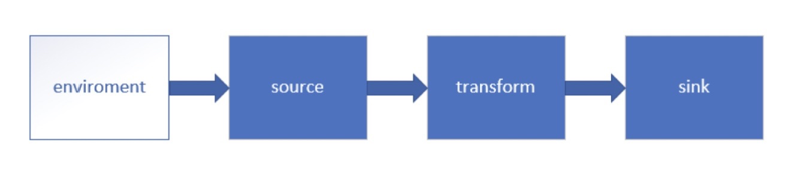

# 尚硅谷2021最新Java版Flink

## 4 Flink运行架构
### 4.1 Flink运行时的组件
#### 4.1.1 作业管理器(JobManager)
* 控制一个应用程序执行的主进程，也就是说，每个应用程序都会被一个不同的JobManager所控制执行。
* JobManager会先接收到要执行的应用程序，这个应用程序会包括：作业图(JobGraph)、逻辑数据流图(logical dataflow graph)和打包了所有的类、库和其他资源的JAR包。
* JobManager会把JobGraph转换成一个物理层面的数据流图，这个图被叫做"执行图(ExecutionGraph)"，包含了所有可以并发执行的任务。
* JobManager会向资源管理器(ResourceManager)请求执行任务必要的资源，也就是任务管理器(TaskManager)上的插槽(slot)。一旦它获取到了足够的资源，就会将执行图分发到真正运行它们的TaskManager上。而在运行过程中，JobManager会负责所有需要中央协调的操作，比如检查点(checkpoints)的协调。

#### 4.1.2 任务管理器(TaskManager)
* Flink中的工作进程，通常在Flink中会有多个TaskManager运行，每一个TaskManager都包含了一定数量的插槽(slots)。插槽的数量限制了TaskManager能够执行的任务数量。
* 启动之后，TaskManager会向资源管理器注册它的插槽；收到资源管理器的指令后，TaskManager就会将一个或者多个插槽提供给JobManager调用。JobManager就可以向插槽分配任务(tasks)来执行了。
* 在执行过程中，一个TaskManager可以跟其它运行同一应用程序的TaskManager交换数据。

#### 4.1.3 资源管理器(ResourceManager)
* 主要负责管理任务管理器(TaskManager)的插槽(slot)，TaskManager插槽是Flink中定义的处理资源单元。
* Flink为不同的环境和资源管理工具提供了不同资源管理器，比如YARN、Mesos、K8s，以及standalone部署。
* 当JobManager申请插槽资源时，ResourceManager会将有空闲插槽的TaskManager分配给JobManager。如果ResourceManager没有足够的插槽来满足JobManager的请求，它还可以向资源提供平台发起会话，以提供启动TaskManager进程的容器。

#### 4.1.4 分发器(Dispacher)
* 可以跨作业运行，它为应用提供了REST接口。
* 当一个应用被提交执行时，分发器就会启动并将应用移交给一个JobManager。
* Dispacher也会启动一个Web UI，用来方便地展示和监控作业执行的信息。
* Dispacher在架构中可能并不是必需的，这取决于应用提交运行的方式。

### 4.2 任务提交流程
#### 4.2.1 作业提交流程


> ps：上图中7.指TaskManager为JobManager提供slots，8.表示JobManager提交要在slots中执行的任务给TaskManager。

上图是从一个较为高层级的视角来看应用中各组件的交互协作。
如果部署的集群环境不同（例如YARN，Mesos，Kubernetes，standalone等），其中一些步骤可以被省略，或是有些组件会运行在同一个JVM进程中。

#### 4.2.2 Yarn上作业提交流程


1. Flink任务提交后，Client向HDFS上传Flink的Jar包和配置。
2. 之后客户端向Yarn ResourceManager提交任务，ResourceManager分配Container资源并通知对应的NodeManager启动ApplicationMaster。
3. ApplicationMaster启动后加载Flink的Jar包和配置构建环境，去启动JobManager，之后JobManager向Flink自身的RM进行申请资源，自身的RM向Yarn 的ResourceManager申请资源(因为是yarn模式，所有资源归yarn RM管理)启动TaskManager。
4. Yarn ResourceManager分配Container资源后，由ApplicationMaster通知资源所在节点的NodeManager启动TaskManager。
5. NodeManager加载Flink的Jar包和配置构建环境并启动TaskManager，TaskManager启动后向JobManager发送心跳包，并等待JobManager向其分配任务。


### 4.3 任务调度原理


1、基于代码生成数据流图(Dataflow graph)，通过客户端提交到JobManager上。
2、JobManager拿到数据流图后分析和处理，生成可执行的数据流图；客户端提交或者取消在JobManager上的job，JobManager返回给客户端一些job的状态信息和返回结果。
3、当前作业有一个JobManager和多个TaskManager，每个TaskManager有多个Task Slot，JobManager分配的任务都要在Slot上执行。
4、JobManager分配或者取消job在TaskManager上，同时发送checkpoints指令保存当前状态，TaskManager会向JobManager发送一些状态信息、心跳信息、统计信息等。
5、slot上的任务执行完毕后向下游去传递，TaskManager之间会有数据流动的过程。

### 4.4 Slot和任务调度
#### 4.4.1 思考
1、怎样实现并行计算？ 
* 不同的任务分配到不同的slot上

2、并行的任务，需要占用多少slot？
* 累加每个组中的最大并行度

3、一个流处理程序，到底包含多少个任务？
* 累加每个算子的并行度

#### 4.4.2 并行度(Parallelism)


* 一个特定算子的子任务(subtask)的个数被称之为其并行度(Parallelism)。
* 一般情况下，一个stream的并行度，可以认为就是其所有算子中的最大的并行度。

#### 4.4.3 TaskManager和Slots


* slot是执行一个独立任务，所需要计算资源的最小单元，每个slot都有独享内存，slot之间是隔离的。推荐按照当前TaskManager的CPU核心数量来设置slot。
* Flink中每一个TaskManager都是一个JVM进程，它可能会在独立的线程上执行一个或多个子任务。
* 为了控制一个TaskManager能接收多少个task，TaskManager通过task slot来进行控制(一个TaskManager至少有一个slot)。


* 默认情况下，Flink允许子任务共享slot，即使它们是不同任务的子任务。这样的结果是，一个slot可以保存作业的整个管道。
* Task slot是静态的概念，是指TaskManager具有的并发执行能力。

#### 4.4.4 并行子任务的分配


* 一共有16个子任务，需要4个slot完成。
* 每个任务都是一个线程，不同的任务线程抢占相同的slot资源，因此多个线程可在同一个slot中。


> 设置合适的并行度才能提高效率，上图例子中应该设置并行度为9。
> ps：上图最后一个因为是输出到文件，避免多个Slot（多线程）里的算子都输出到同一个文件互相覆盖等混乱问题，直接设置sink的并行度为1。

#### 4.4.5 程序与数据流


* 所有的Flink程序都是由三部分组成的：Source、Transformance和Sink。
* Source负责读取数据源，Transformance利用各种算子进行处理加工，Sink负责输出。
* 在运行时，Flink上运行的程序会被映射成"逻辑数据流(dataflows)"，它包含了这三部分。
* 每一个dataflow以一个或多个sources开始以一个或者多个sinks结束。dataflow类似于任意的有向无环图(DAG)。
* 在大部分情况下，程序中的转换运算(transformations)跟dataflow中的算子(operator)是一一对应的关系。


#### 4.4.6 执行图
Fink中的执行图可以分为四层：StreamGraph->JobGraph->ExecutionGraph->物理执行图
* StreamGraph:是根据用户通过Stream API编写的代码生成的最初的图。用来表示程序的拓扑结构。
* JobGraph:StreamGraph经过优化后生成了JobGraph，提交给JobManager的数据结构。主要的优化为，将多个符合条件的节点chain在一起作为一个节点。
* ExecutionGraph:JobManager根据JobGraph生成ExecutionGraph。ExecutionGraph是JobGraph的并行化版本，是调度层最核心的数据结构。
* 物理执行图:JobManager根据ExecutionGraph对Job进行调度后，在各个TaskManager上部署Task后形成的"图"，并不是一个具体的数据结构。


#### 4.4.7 数据传输形式
* 一个程序中，不同的算子可能具有不同的并行度。
* 算子之间传输数据的形式可以是one-to-one(forwarding)的模式也可以是redistributing的模式，具体是哪一种形式，取决于算子的种类。
* one-to-one:stream维护着分区以及元素的顺序(比如source和map之间)。这意味着map算子的子任务看到的元素的个数以及顺序跟source算子的子任务生成的元素的个数、顺序相同。map、filter、flatMap等算子都是one-to-one的对应关系。类似于spark中的窄依赖。
* redistributing:stream的分区会发生改变。每一个算子的子任务依据所选择的transformation发送数据到不同的目标任务。例如，keyBy基于hashCode重分区，而broadcast和rebalance会随机重新分区，这些算子都会引起redistribute过程，而redistribute过程就类似于Spark中的shuffle过程。类似于spark中的宽依赖。

#### 4.3.5 任务链
* Flink采用了一种称为任务链的优化技术，可以在特定条件下减少本地通信的开销。为了满足任务链的要求，必须将两个或多个算子设为相同的并行度，并通过本地转发(localforward)的方式进行连接。
* 相同并行度的one-to-one操作，Flink这样相连的算子链接在一起形成一个task，原来的算子成为里面的subtask。
* 并行度相同、并且是one-to-one操作，必须是同一个slot共享组，三个条件缺一不可
* 如果不想合并成算子，可以采用添加slot共享组(会额外添加slot)、rebalance、disableChaining(跟前后流程都不合并)、startNewChain(流程后不合并)等方法。
* 不合并算子的好处有哪些？❌


## 5 Flink流处理API


### 5.1 Environment
#### 5.1.1 getExecutionEnvironment
创建一个执行环境，表示当前执行程序的上下文。如果程序是独立调用的，则此方法返回本地执行环境；如果从命令行客户端程序以提交到集群，则此方法返回此集群的执行环境，也就是说，getExecutionEnvironment会根据查询运行的方式决定返回什么样的运行环境，是最常用的一种创建执行环境的方式。

```
批处理
ExecutionEnvironment env = ExecutionEnvironment.getExecutionEnvironment();
```

```
流处理
StreamExecutionEnvironment env = StreamExecutionEnvironment.getExecutionEnvironment();
```
如果没有设置并行度，会以flink-conf.yaml中的配置为准，默认是1。


#### 5.1.2 createLocalEnvironment
返回本地执行环境，需要在调用时指定默认的并行度，如果不设置，则为当前的CPU核心数。

```
LocalStreamEnvironment env = StreamExecutionEnvironment.createLocalEnvironment(1);
```

#### 5.1.3 createRemoteEnvironment
返回集群执行环境，将Jar提交到远程服务器。需要在调用时指定JobManager的IP和端口号，并指定要在集群中运行的Jar包。

```
StreamExecutionEnvironment env = StreamExecutionEnvironment.createRemoteEnvironment("localhost", 6123, "WordCount.jar");
```

### 5.2 Source
#### 5.2.1 从集合中读取数据

```
public class SourceTest1_Collection {
    public static void main(String[] args) throws Exception {
        //创建执行环境
        StreamExecutionEnvironment env = StreamExecutionEnvironment.getExecutionEnvironment();
        //设置全局并行度为1，按顺序输出，因为是两个stream，只能保证单个stream中顺序输出，两个stream会可能交叉输出
        env.setParallelism(1);
        //从集合中读取数据
        DataStream<SensorReading> dataStream = env.fromCollection(Arrays.asList(
                new SensorReading("sensor_1", 1547718199L, 35.8),
                new SensorReading("sensor_6", 1547718201L, 15.4),
                new SensorReading("sensor_7", 1547718202L, 6.7),
                new SensorReading("sensor_10", 1547718205L, 38.1)
        ));

        DataStream<Integer> integerDataStream = env.fromElements(1, 2, 4, 67, 189);

        //打印
        dataStream.print("data");
        integerDataStream.print("int");

        //执行
        env.execute();
    }
}

@Lombok
public class SensorReading {
    /**
     * 属性：id、时间戳、温度值
     */
    private String id;
    private Long timestamp;
    private Double temperature;
}
```
#### 5.2.2 从文件中读取数据

```
public class SourceTest2_File {
    public static void main(String[] args) throws Exception {
        StreamExecutionEnvironment env = StreamExecutionEnvironment.getExecutionEnvironment();
        env.setParallelism(1);
        //从文件中读取数据
        DataStream<String> dataStream = env.readTextFile("文件路径");
        //打印输出
        dataStream.print();
        env.execute();
    }
}      
```

#### 5.2.3 从kafka中读取数据
引入kafka连接器依赖

```
<dependency>
			<groupId>org.apache.flink</groupId>
			<artifactId>flink-connector-kafka-0.11_2.12</artifactId>
			<version>1.10.1</version>
</dependency>
```
具体代码如下：
```
public class SourceTest3_Kafka {
    public static void main(String[] args) throws Exception {
        StreamExecutionEnvironment env = StreamExecutionEnvironment.getExecutionEnvironment();
        env.setParallelism(1);
        //配置kafka连接信息
        Properties properties = new Properties();
        properties.setProperty("bootstrap.servers", "localhost:9092");
        properties.setProperty("group.id", "consumer-group");
        properties.setProperty("key.deserializer", "org.apache.kafka.common.serialization.StringDeserializer");
        properties.setProperty("value.deserializer", "org.apache.kafka.common.serialization.StringDeserializer");
        properties.setProperty("auto.offset.reset", "latest");
        //从kafka读取数据
        DataStream<String> dataStream = env.addSource(new FlinkKafkaConsumer011<String>("sersor", new SimpleStringSchema(), properties));
        //输出
        dataStream.print();
        //执行
        env.execute();
    }
}
```

#### 5.2.4 自定义source
除了以上的source数据源，我们还可以自定义数据源，只需要传入一个sourceFunction就可以了。具体调用如下：

```
public class SourceTest4_UDF {
    public static void main(String[] args) throws Exception {
        StreamExecutionEnvironment env = StreamExecutionEnvironment.getExecutionEnvironment();
        env.setParallelism(1);
        //从数据源中读取数据
        DataStream<SensorReading> dataStream = env.addSource(new MySensorSource());
        //打印输出
        dataStream.print();
        env.execute();
    }
    /**
     * 实现自定义的SourceFunction
     */
    public static class MySensorSource implements SourceFunction<SensorReading> {
        //定义一个标识位，用来控制数据的产生
        private boolean running = true;
        @Override
        public void run(SourceContext<SensorReading> ctx) throws Exception {
            //定义一个随机数发生器
            Random random = new Random();

            //设置10个传感器的初始温度
            HashMap<String, Double> sensorTempMap = new HashMap<>();
            for (int i = 0; i < 10; i++) {
                sensorTempMap.put("sensor_" + (i + 1), random.nextGaussian() * 20);
            }
            while (running) {
                for (String sensorId : sensorTempMap.keySet()) {
                    Double newTemp = sensorTempMap.get(sensorId) + random.nextGaussian();
                    sensorTempMap.put(sensorId, newTemp);
                    ctx.collect( new SensorReading(sensorId, System.currentTimeMillis(), newTemp));
                }
                Thread.sleep(1000L);
            }
        }
        @Override
        public void cancel() {
            running = false;
        }
    }
}
```

### 5.3 Transform
map、flatMap、filter属于基本(简单)转换算子，不会影响到下游分区的顺序，来一个处理一个，没有其他额外的操作。
KeyBy、滚动聚合算子、Reduce属于聚合操作，flink中所有的聚合操作都要在keyby分组之后，DataStream中没有聚合方法，只有KeyedStream才有聚合方法。
Splilt、Select、Connect、CoMap和Union属于多流转换操作。
#### 5.3.1 map

特点：来一个走一个，非常简单。

```
//1.map，把String转换成长度输出
DataStream<Integer> mapStream = inputStream.map(new MapFunction<String, Integer>() {
    @Override
    public Integer map(String value) throws Exception {
        return value.length();
    }
});
```
#### 5.3.2 flatMap
特点：打散，把数据做一个拆分，来一个数据可以生成多条数据。

```
//2.flatmap，按逗号分字段
DataStream<String> flatMapStream = inputStream.flatMap(new FlatMapFunction<String, String>() {
    @Override
    public void flatMap(String value, Collector<String> out) throws Exception {
        String[] fields = value.split(",");
        for (String field : fields) {
            out.collect(field);
        }
    }
});
```
#### 5.3.3 filter

特点：筛选过滤，可能不输出也可能输出。

```
//3.filter，筛选sensor_1开头的id对应的数据
DataStream<String> filterStream = inputStream.filter(new FilterFunction<String>() {
    @Override
    public boolean filter(String value) throws Exception {
        return value.startsWith("sensor_1");
    }
});
```
#### 5.3.4 KeyBy

特点：保证相同的key能进到同一分区，但同一分区也会包含其他key。
DataStream -> KeyedStream：逻辑地将一个流拆分成不同的分区，每个分区包含具有相同的key的元素，在内部以hash的形式实现的。
#### 5.3.5 滚动聚合算子(Rolling Aggregation)
这些算子可以针对KeyedStream的每一个支流做聚合。
* sum() 
* min() 
* max() 
* minBy()
* maxBy() 

```
public class TransformTest2_RollingAggregation {
    public static void main(String[] args) throws Exception {
        StreamExecutionEnvironment env = StreamExecutionEnvironment.getExecutionEnvironment();
        env.setParallelism(1);
        //从文件中读取数据
        DataStream<String> inputStream = env.readTextFile("/tmp/demo/frauddetection/src/main/resources/sensor.txt");
        //转换成SensorReading类型
//        DataStream<SensorReading> dataStream = inputStream.map(new MapFunction<String, SensorReading>() {
//            @Override
//            public SensorReading map(String value) throws Exception {
//                String[] fields = value.split(",");
//                return new SensorReading(fields[0], new Long(fields[1]), new Double(fields[2]));
//            }
//        });
        DataStream<SensorReading> dataStream = inputStream.map(value -> {
            String[] fields = value.split(",");
            return new SensorReading(fields[0], new Long(fields[1]), new Double(fields[2]));
        });
        //分组
        KeyedStream<SensorReading, Tuple> keyedStream = dataStream.keyBy("id");
        //KeyedStream<SensorReading, String> keyedStream1 = dataStream.keyBy(SensorReading::getId);
        //KeyedStream<SensorReading, Tuple> keyedStream2 = dataStream.keyBy(0);
        //滚动聚合，取当前最大的温度值
        DataStream<SensorReading> resultStream = keyedStream.minBy("temperature");
        //打印输出
        resultStream.print();
        env.execute();
    }
}
```
#### 5.3.6 reduce聚合
KeyedStream -> DataStream：一个分组数据流的聚合操作，合并当前的元素和上次聚合的结果，产生一个新值，返回的流中包含每一次聚合的结果，而不是只返回最后一次聚合的最终结果。

```
public class TransformTest3_RollingAggregation {
    public static void main(String[] args) throws Exception {
        StreamExecutionEnvironment env = StreamExecutionEnvironment.getExecutionEnvironment();
        env.setParallelism(1);
        //从文件中读取数据
        DataStream<String> inputStream = env.readTextFile("/Users/jingdata-10124/code/flink/demo/frauddetection/src/main/resources/sensor.txt");
        DataStream<SensorReading> dataStream = inputStream.map(value -> {
            String[] fields = value.split(",");
            return new SensorReading(fields[0], new Long(fields[1]), new Double(fields[2]));
        });
        //分组
        KeyedStream<SensorReading, Tuple> keyedStream = dataStream.keyBy("id");
        //reduce聚合，取最大的温度值以及最新时间
        DataStream<SensorReading> reduceStream = keyedStream.reduce((value1, value2) -> new SensorReading(value1.getId(), value2.getTimestamp(), Math.max(value1.getTemperature(), value2.getTemperature())));
        reduceStream.print();
        env.execute();
    }
}
```
#### 5.3.7 Spilt和Select


DataStream -> SpiltStream：根据某些特征把一个DataStream拆分成两个或者多个DataStream。


SpiltStream -> DataStream：从一个SpiltStream中获取一个或者多个DataStream。
需求：传感器数据按照温度高低(以30度为界)，拆分成两个流

```
SplitStream<SensorReading> splitStream = dataStream.split(new 
OutputSelector<SensorReading>() {
    @Override
    public Iterable<String> select(SensorReading value) {
        return (value.getTemperature() > 30) ? Collections.singletonList("high") : 
Collections.singletonList("low");
}
});
DataStream<SensorReading> highTempStream = splitStream.select("high");
DataStream<SensorReading> lowTempStream = splitStream.select("low");
DataStream<SensorReading> allTempStream = splitStream.select("high", "low");
```
flink现在已经把SpiltStream删除了，可用process加OutputTag实现。

```
public class TransformTest4_MultipleStreams {
    private static final OutputTag<SensorReading> highTempStream = new OutputTag<SensorReading>("high"){};
    private static final OutputTag<SensorReading> lowTempStream = new OutputTag<SensorReading>("low"){};

    public static void main(String[] args) throws Exception {
        StreamExecutionEnvironment env = StreamExecutionEnvironment.getExecutionEnvironment();
        env.setParallelism(1);
        //从文件中读取数据
        DataStream<String> inputStream = env.readTextFile("/Users/jingdata-10124/code/flink/demo/frauddetection/src/main/resources/sensor.txt");
        DataStream<SensorReading> dataStream = inputStream.map(value -> {
            String[] fields = value.split(",");
            return new SensorReading(fields[0], new Long(fields[1]), new Double(fields[2]));
        });
        //1.按照温度值30度值为界分为两条
        SingleOutputStreamOperator<SensorReading> outputStream = dataStream.process(new ProcessFunction<SensorReading, SensorReading>() {
            @Override
            public void processElement(SensorReading sensorReading, Context ctx, Collector<SensorReading> out) throws Exception {
                if (sensorReading.getTemperature() > 30) {
                    ctx.output(highTempStream, sensorReading);
                } else {
                    ctx.output(lowTempStream, sensorReading);
                }
            }
        });
        outputStream.getSideOutput(highTempStream).print("high");
        outputStream.getSideOutput(lowTempStream).print("low");
        env.execute();
    }
}
```
#### 5.3.8 Connect和CoMap


DataStream，DataStream -> ConnectedStreams：连接两个保持它们类型的数据流，两个数据流被Connect之后，只是被放在了同一个流中，内部依然保持各自的数据和形式不发生任何变化，两个流相互独立，数据类型可以不一样。


ConnectedStreams -> DataStream：作用于ConnectedStreams上，功能与map和flatMap一样，对ConnectedStreams中的每一个Stream分别进行map和flatMap处理。


```
//2.合流connect，将高温流转换成二元组类型，与低温流连接合并之后，输出状态信息
SingleOutputStreamOperator<Tuple2<String, Double>> warningStream = outputStream.getSideOutput(highTempStream).map(new MapFunction<SensorReading, Tuple2<String, Double>>() {
    @Override
    public Tuple2<String, Double> map(SensorReading sensorReading) throws Exception {
        return new Tuple2<>(sensorReading.getId(), sensorReading.getTemperature());
    }
});
ConnectedStreams<Tuple2<String, Double>, SensorReading> connectedStreams = warningStream.connect(outputStream.getSideOutput(lowTempStream));
SingleOutputStreamOperator<Object> resultStream = connectedStreams.map(new CoMapFunction<Tuple2<String, Double>, SensorReading, Object>() {
    @Override
    public Object map1(Tuple2<String, Double> value) throws Exception {
        return new Tuple3<>(value.f0, value.f1, "high temp warning");
    }

    @Override
    public Object map2(SensorReading value) throws Exception {
        return new Tuple2<>(value.getId(), "normal");
    }
});
resultStream.print("result");
```

#### 5.3.9 Union


DataStream -> DataStream：对两个及以上的DataSteam进行union操作，产生一个包含所有DataStream元素的新DataStream，前提是这些流的数据类型必须一样。

```
//3.union联合多条流outputStream.getSideOutput(highTempStream).union(outputStream.getSideOutput(lowTempStream));
```

Connect与Union区别：
1.union之前两个流的类型必须是一样的，Connect可以不一样，在之后的coMap中再去调整成为一样的。
2.Connect只能操作两个流，Union可以操作多个。

总结：所以转换算子的底层都是DataStream。

### 5.4 支持的数据类型


