高性能图数据库Neo4j从入门到实战教程，2021最新版【通俗易懂】
地址：[https://www.bilibili.com/video/BV1HQ4y1h78j](https://www.bilibili.com/video/BV1HQ4y1h78j)
# 1.图数据库Neo4j介绍
## 1.1 什么是图数据库（graph database）
随着社交、电商、金融、零售、物联网等行业的快速发展，现实社会织起了了一张庞大而复杂的关系网，传统数据库很难处理关系运算。大数据行业需要处理的数据之间的关系随数据量呈几何级数增长，急需一种支持海量复杂数据关系运算的数据库，图数据库应运而生。

世界上很多著名的公司都在使用图数据库，比如:
* 社交领域：Facebook, Twitter，Linkedin用它来管理社交关系，实现好友推荐
* 零售领域：eBay，沃尔玛使用它实现商品实时推荐，给买家更好的购物体验
* 金融领域：摩根大通，花旗和瑞银等银行在用图数据库做风控处理
* 汽车制造领域：沃尔沃，戴姆勒和丰田等顶级汽车制造商依靠图数据库推动创新制造解决方案
* 电信领域：Verizon, Orange和AT&T等电信公司依靠图数据库来管理网络，控制访问并支持客户
* 酒店领域：万豪和雅高酒店等顶级酒店公司依使用图数据库来管理复杂且快速变化的库存 

图数据库并非指存储图片的数据库，而是以图数据结构存储和查询数据。
图数据库是基于图论实现的一种NoSQL数据库，其数据存储结构和数据查询方式都是以图论为基础的，图数据库主要用于存储更多的连接数据。
> 图论〔Graph Theory〕是数学的一个分支。它以图为研究对象图论中的图是由若干给定的点及连 接两点的线所构成的图形，这种图形通常用来描述某些事物之间的某种特定关系，用点代表事物， 用连接两点的线表示相应两个事物间具有这种关系。
> 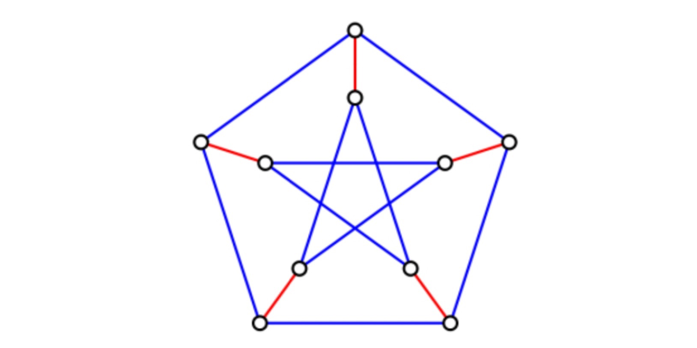

使用 Google+(GooglePlus)应用程序来了解现实世界中 Graph 数据库的需求。 观察下面的图表。在这里，我们用圆圈表示了 Google+应用个人资料。
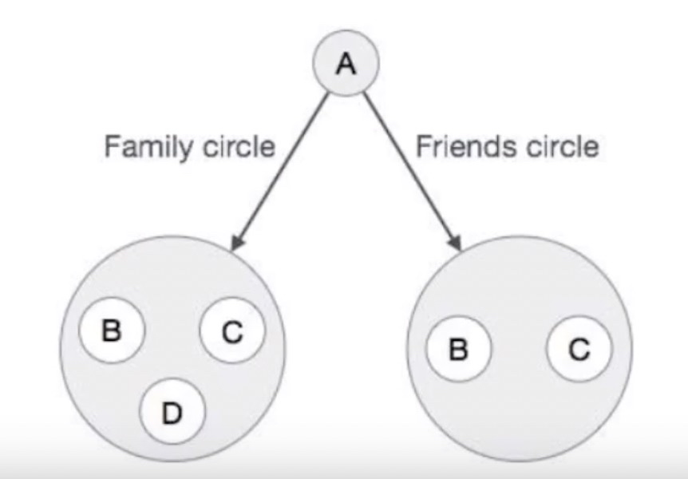


在上图中，轮廓“A”具有圆圈以连接到其他轮廓:家庭圈(B，C，D)和朋友圈(B，C)。如果我们打开配置文件“B”，我们可以观察以下连接的数据。
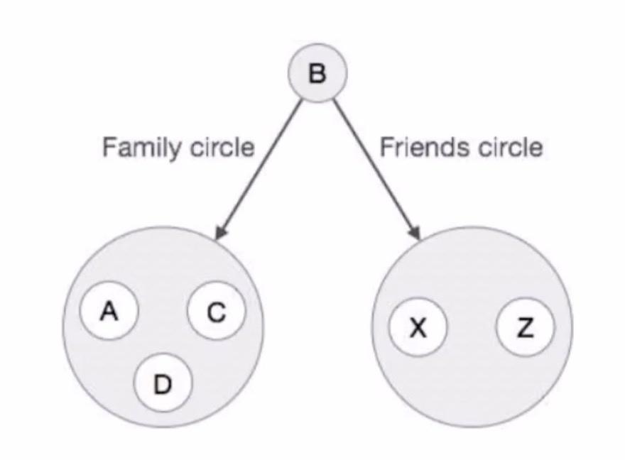

像这样，这些应用程序包含大量的结构化，半结构化和非结构化的连接数据。在RDBMS数据库中表示这种非结构化连接数据并不容易。如果我们在RDBMS数据库中存储这种更多连接的数据，那么检索或遍历是非常困难和缓慢的。所以要表示或存储这种更连接的数据，我们应该选择一个流行的图数据库。
图数据库非常容易地存储这种更多连接的数据。它将每个配置文件数据作为节点存储在内部，它与相邻节点连接的节点，它们通过关系相互连接。他们存储这种连接的数据与上面的图表中的相同，这样检索 或遍历是非常容易和更快的。

* 关系查询性能对比

在数据关系中心，图形数据库在查询速度方面非常高效，即使对于深度和复杂的查询 也是如此。在关系型数据库和图数据库(Neo4j)之间进行了实验:在一个社交网络里找到最大深度为5的 朋友的朋友，他们的数据集包括100万人，每人约有50个朋友。
实验结果如下：
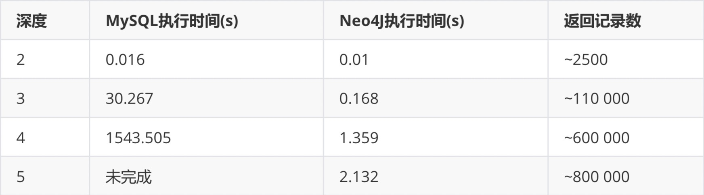

* 对比关系型数据库

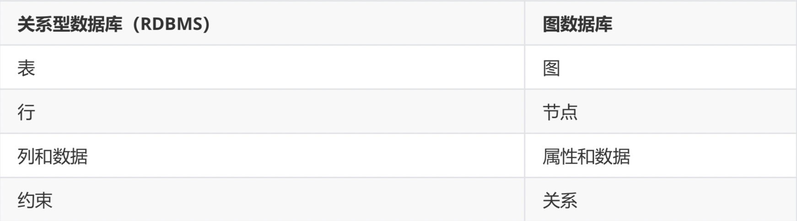
在关系型数据库中，Person和Department表之间用外键表示关系：
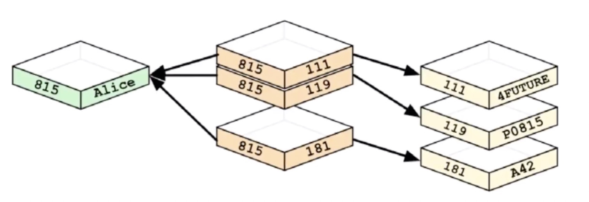
在图数据库中，节点和关系取代表，外键和join：
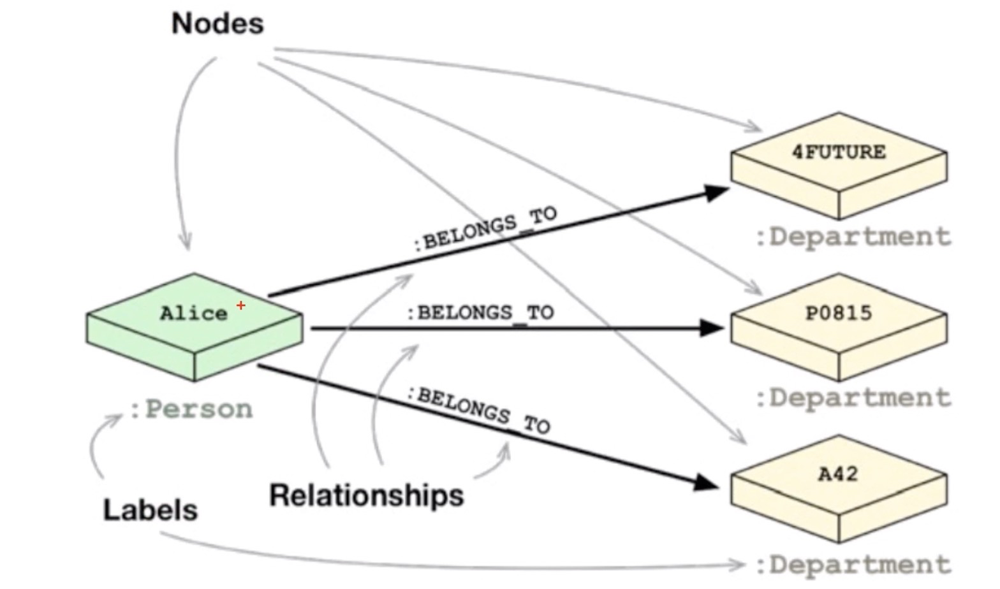
在图数据库中，无论何时运行类似JOIN的操作，数据库都会使用此列表并直接访问连接的节点，而无需进行昂贵的搜索和匹配计算。

* 对比其他NoSQL数据库

NoSQL数据库大致可以分为四类:
* 键值(key/value)数据库 
* 列存储数据库 
* 文档型数据库 
* 图数据库 


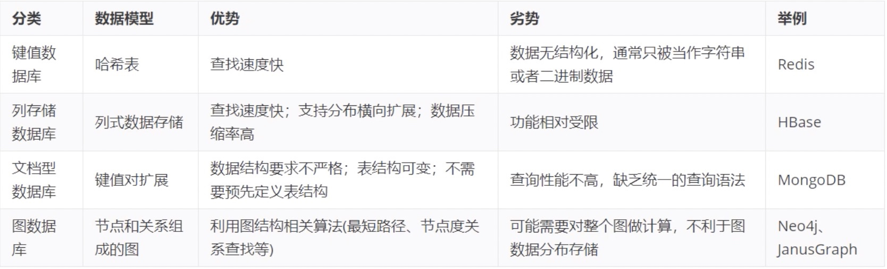

## 1.2 什么是Neo4j
Neo4j是一个开源的NoSQL图形数据库，2003年开始开发，使用scala和java语言，2007年开始发布。
* 是世界上最先进的图数据库之一，提供原生的图数据存储，检索和处理
* 采用属性图模型(Property graph model)，极大的完善和丰富图数据模型
* 专属查询语言Cypher，直观，高效

官网:[https://neo4j.com/](https://neo4j.com/)
Neo4j的特性:
* SQL就像简单的查询语言Neo4j CQL
* 它遵循属性图数据模型
* 它通过使用Apache Lucence支持索引
* 它支持UNIQUE约束
* 它包含一个用于执行CQL命令的UI:Neo4j数据浏览器
* 它支持完整的ACID(原子性，一致性，隔离性和持久性)规则
* 它采用原生图形库与本地GPE(图形处理引擎)
* 它支持查询的数据导出到JSON和XLS格式
* 它提供了REST API，可以被任何编程语言(如Java，Spring，Scala等)访问
* 它提供了可以通过任何UI MVC框架(如Node JS)访问的Java脚本
* 它支持两种Java API:Cypher API和Native Java API来开发Java应用程序

Neo4j的优点:
* 它很容易表示连接的数据
* 检索/遍历/导航更多的连接数据是非常容易和快速的
* 它非常容易地表示半结构化数据
* Neo4j CQL查询语言命令是人性化的可读格式，非常容易学习
* 使用简单而强大的数据模型
* 它不需要复杂的连接来检索连接的/相关的数据，因为它很容易检索它的相邻节点或关系细节没有连接或索引

## 1.3 Neo4j数据模型
### 1.3.1 图论基础
图是一组节点和连接这些节点的关系，图形以属性的形式将数据存储在节点和关系中，属性是用于表示数据的键值对。
在图论中，我们可以表示一个带有圆的节点，节点之间的关系用一个箭头标记表示。
最简单的可能图是单个节点:


我们可以使用节点表示社交网络(如Google+(GooglePlus)个人资料)，它不包含任何属性。向 Google+个人资料添加一些属性:
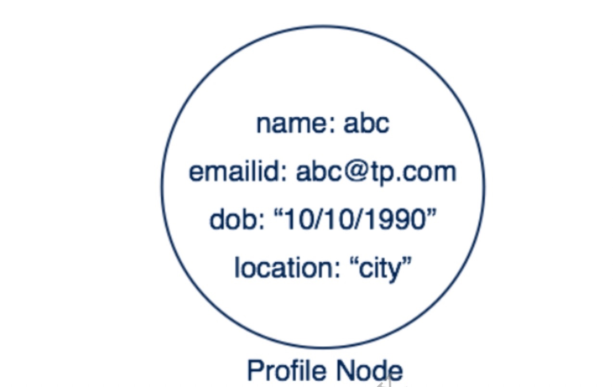

在两个节点之间创建关系：
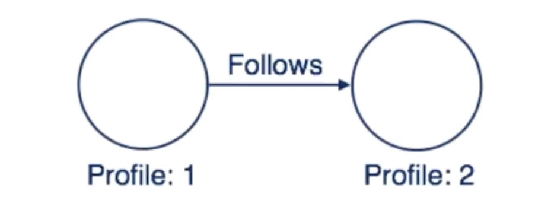

此处在两个配置文件之间创建关系名称“跟随”。这意味着Profile-I遵循Profile-II。
### 1.3.2 属性图模型
Neo4j图数据库遵循属性图模型来存储和管理其数据。
属性图模型规则：
* 表示节点，关系和属性中的数据
* 节点和关系都包含属性
* 关系连接节点
* 属性是键值对
* 节点用圆圈表示，关系用方向键表示
* 关系具有方向:单向和双向
* 每个关系包含“开始节点”或“从节点”和“到节点”或“结束节点”

在属性图数据模型中，关系应该是定向的。如果我们尝试创建没有方向的关系，那么它将抛出一个错误消息。在Neo4j中，关系也应该是有方向性的。如果我们尝试创建没有方向的关系，那么Neo4j会抛出一个错误消息，“关系应该是方向性的”。
Neo4j图数据库将其所有数据存储在节点和关系中，我们不需要任何额外的RDBMS数据库或NoSQL数据 库来存储Neo4j数据库数据，它以图的形式存储数据。Neo4j使用本机GPE(图形处理引擎)来使用它的 本机图存储格式。
图数据库数据模型的主要构建块是:
* 节点
* 关系
* 属性

简单的属性图的例子:
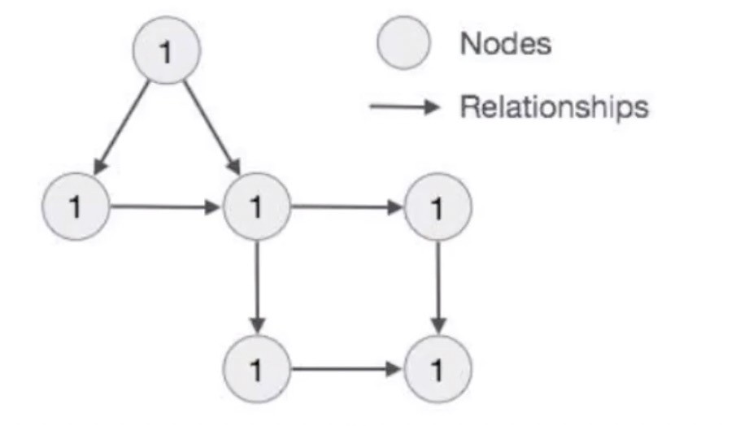

这里我们使用圆圈表示节点。使用箭头表示关系，关系是有方向性的。我们可以Properties(键值对)来表示Node的数据。在这个例子中，我们在Node的Circle中表示了每个Node的Id属性。

## 1.4 Neo4j的构建元素
Neo4j图数据库主要有以下构建元素:
* 节点
* 属性
* 关系
* 标签
* 数据浏览器

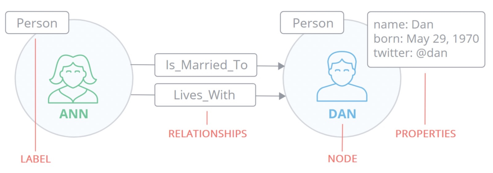

### 1.4.1 节点
节点(Node)是图数据库中的一个基本元素，用来表示一个实体记录，就像关系数据库中的一条记录一样。在Neo4j中节点可以包含多个属性(Property)和多个标签(Label)。
* 节点是主要的数据元素
* 节点通过关系连接到其他节点
* 节点可以具有一个或多个属性(即，存储为键/值对的属性)
* 节点有一个或多个标签，用于描述其在图表中的作用

### 1.4.2 属性
属性(Property)是用于描述图节点和关系的键值对。其中Key是一个字符串，值可以通过使用任何Neo4j数据类型来表示
* 属性是命名值，其中名称(或键)是字符串
* 属性可以被索引和约束
* 可以从多个属性创建复合索引

### 1.4.3 关系
关系(Relationship)同样是图数据库的基本元素。当数据库中已经存在节点后，需要将节点连接起来构成图。关系就是用来连接两个节点，关系也称为图论的边(Edge),其始端和末端都必须是节点，关系不能指向空也不能从空发起。关系和节点一样可以包含多个属性，但关系只能有一个类型(Type)。
* 关系连接两个节点
* 关系是方向性的
* 节点可以有多个甚至递归的关系
* 关系可以有一个或多个属性(即存储为键/值对的属性)

基于方向性，Neo4j关系被分为两种主要类型:
* 单向关系
* 双向关系

### 1.4.4 标签
标签(Label)将一个公共名称与一组节点或关系相关联，节点或关系可以包含一个或多个标签。 我们可以为现有节点或关系创建新标签，我们可以从现有节点或关系中删除标签。
* 标签用于将节点分组
* 一个节点可以具有多个标签
* 对标签进行索引以加速在图中查找节点
* 本机标签索引针对速度进行了优化

### 1.4.5 Neo4j Browser
一旦我们安装Neo4j，我们就可以访问Neo4j数据浏览器：http://localhost:7474/browser/
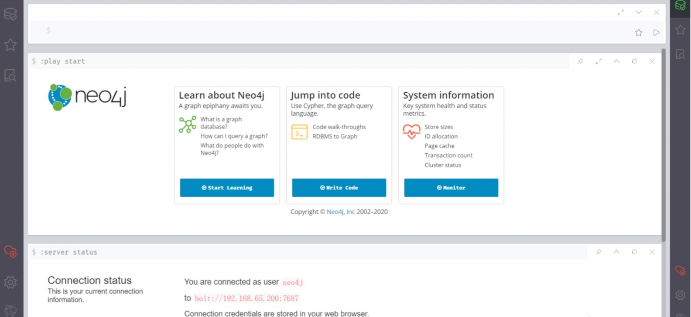

## 1.5 使用场景
* 欺诈检测
* 实时推荐引擎
* 知识图谱
* 反洗钱
* 主数据管理
* 供应链管理
* 增强网络和IT运营管理能力
* 数据谱系
* 身份和访问管理
* 材料清单
* 社交网络

# 2.环境搭建
下载地址:https://neo4j.com/download-center/
安装方式:
* Neo4j Enterprise Server
* Neo4j Community Server
* Neo4j Desktop

## 2.1 安装Neo4j Community Server
注意: neo4j最新版对应的java版本是jdk11
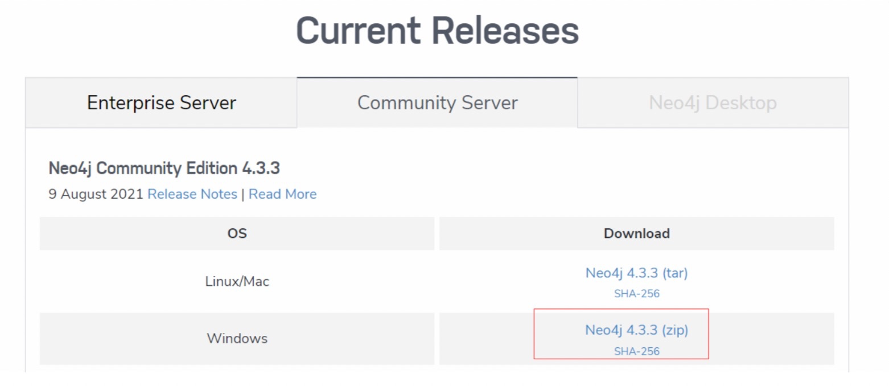
jdk8可以下载Neo4j Community Edition 3.5.28
文档:https://neo4j.com/docs/operations-manual/3.5/
解压到新目录(注意:目录名称不要有中文),比如/code/neo4j

```
# 将Neo4j作为控制台应用程序运行 
<NEO4J_HOME>\bin\neo4j console
# 将Neo4j作为服务使用进行安装
<NEO4J_HOME>\bin\neo4j install-service
```
> console: 直接启动neo4j服务器
> install-service | uninstall-service | update-service : 安装/卸载/更新 neo4j 服务
> start/stop/restart/status: 启动/停止/重启/状态
> -V 输出更多信息
进入到bin目录，执行

```
neo4j console
```
在浏览器中访问http://localhost:7474
使用用户名neo4j和默认密码neo4j进行连接，然后会提示更改密码。
Neo4j Browser是开发人员用来探索Neo4j数据库、执行Cypher查询并以表格或图形形式查看结果的工具。


## 2.2 docker安装Neo4j Community Server
* 7474 for HTTP.
* 7473 for HTTPS.
* 7687 for Bolt.

拉取镜像

```
docker pull neo4j:3.5.22-community
```
运行镜像

```
docker run -d -p 7474:7474 -p 7687:7687 --name neo4j \
  -e "NEO4J_AUTH=neo4j/123456" \
  -v /usr/local/soft/neo4j/data:/data \
  -v /usr/local/soft/neo4j/logs:/logs \
  -v /usr/local/soft/neo4j/conf:/var/lib/neo4j/conf \
  -v /usr/local/soft/neo4j/import:/var/lib/neo4j/import \
neo4j:3.5.22-community
```

## 2.3 Neo4j Desktop安装
下载安装包默认安装


启动后可以选择安装本地neo4j数据库或者连接远程neo4j数据库。
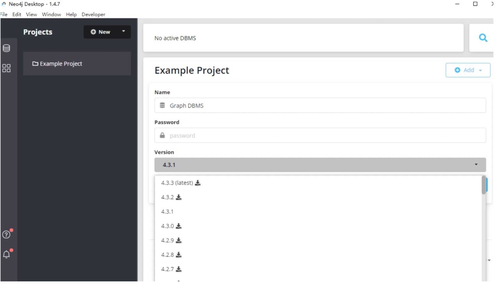


# 3.Neo4j - CQL使用
## 3.1 Neo4j - CQL简介
Neo4j的Cypher语言是为处理图形数据而构建的，CQL代表Cypher查询语言。像Oracle数据库具有查询 语言SQL，Neo4j具有CQL作为查询语言。
* 它是Neo4j图形数据库的查询语言
* 它是一种声明性模式匹配语言
* 它遵循SQL语法
* 它的语法是非常简单且人性化、可读的格式

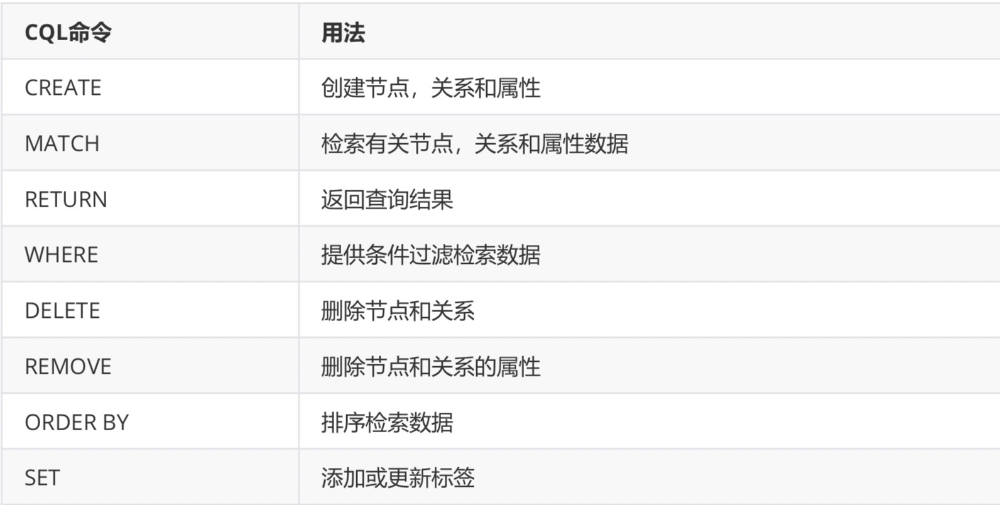
三个共同朋友的社交图:
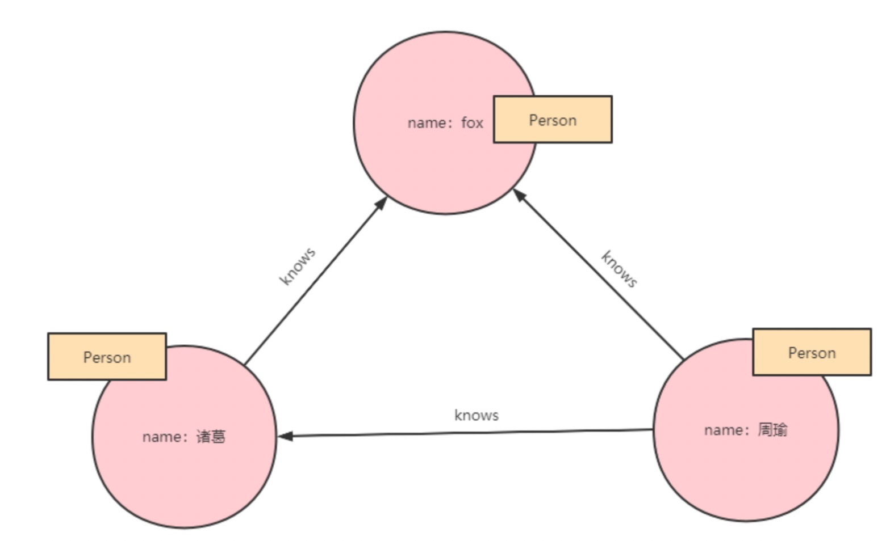
使用cypher语言来描述关系:

```
(fox)<-[:knows]-(周瑜)-[:knows]->(诸葛)-[:knows]->(fox)
```
## 3.2 常用命令
文档地址：https://neo4j.com/docs/cypher-manual/3.5/clauses/
### 3.2.1 LOAD CSV
导入csv到neo4j
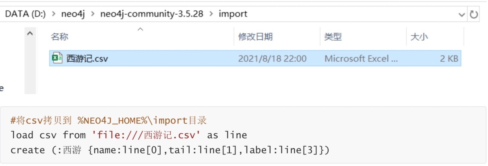

```
#将csv拷贝到 %NEO4J_HOME%\import目录
load csv from 'file:///西游记.csv' as line
create (:西游 {name:line[0],tail:line[1],label:line[3]})
```
### 3.2.2 CREATE创建
create语句是创建模型语句用来创建数据模型
创建节点

```
#创建简单节点 create (n) #创建多个节点 create (n),(m)
#创建带标签和属性的节点并返回节点
create (n:person {name:'如来'}) return n
```
创建关系
Neo4j图数据库遵循属性图模型来存储和管理其数据。
根据属性图模型，关系应该是定向的。 否则，Neo4j将抛出一个错误消息。
基于方向性，Neo4j关系被分为两种主要类型。
* 单向关系
* 双向关系

```
#使用新节点创建关系
CREATE (n:person {name:'杨戬'})-[r:师傅]->(m:person {name:'玉鼎真人'}) return type(r)
#使用已知节点创建带属性的关系
match (n:person {name:'沙僧'}),(m:person{name:'唐僧'}) create (n)-[r:`师傅`{relation:'师傅'}]->(m) return r
#检索关系节点的详细信息
match (n:person)-[r]-(m:person) return n,m
```
创建全路径

```
create p=(:person{name:'蛟魔王'})-[:义兄]->(:person{name:'牛魔王'})<-[:义兄]- (:person {name:'鹏魔王'}) return p
```

### 3.2.3 MATCH查询
Neo4j CQL MATCH命令用于
* 从数据库获取有关节点和属性的数据
* 从数据库获取有关节点，关系和属性的数据

```
MATCH (n:`西游`) RETURN n LIMIT 25
```
### 3.2.4 RETURN返回
Neo4j CQL RETURN子句用于
* 检索节点的某些属性
* 检索节点的所有属性
* 检索节点和关联关系的某些属性
* 检索节点和关联关系的所有属性

```
MATCH (n:`西游`) RETURN id(n),n.name,n.tail,n.relation
```
### 3.2.5 WHERE子句
像SQL一样，Neo4j CQL在CQL MATCH命令中提供了WHERE子句来过滤MATCH查询的结果。

```
MATCH (n:person) where n.name='孙悟空' or n.name='猪八戒' RETURN n
#创建关系
match (n:person),(m:person) where n.name='孙悟空' and m.name='猪八戒' create (n)-[r:师弟]->(m) return n.name,type(r),m.name
```
### 3.2.6 DELETE删除
Neo4j使用CQL DELETE子句
* 删除节点
* 删除节点及相关节点和关系

```
# 删除节点 (前提:节点不存在关系)
MATCH (n:person{name:"白龙马"}) delete n
# 删除关系
MATCH (n:person{name:"沙僧"})<-[r]-(m) delete r return type(r)
```
### 3.2.7 REMOVE删除
有时基于客户端要求，我们需要向现有节点或关系添加或删除属性。我们使用Neo4j CQL REMOVE子句来删除节点或关系的现有属性。
* 删除节点或关系的标签
* 删除节点或关系的属性

```
#删除属性
MATCH (n:role {name:"fox"}) remove n.age return n
#创建节点
CREATE (m:role:person {name:"fox666"})
#删除标签
match (m:role:person {name:"fox666"}) remove m:person return m
```
### 3.2.8 SET子句
有时，根据我们的客户端要求，我们需要向现有节点或关系添加新属性。要做到这一点，Neo4j CQL提供了一个SET子句。
* 向现有节点或关系添加新属性
* 添加或更新属性值

```
MATCH (n:role {name:"fox"}) set n.age=32   return n
```
### 3.2.9 ORDER BY排序
Neo4j CQL在MATCH命令中提供了“ORDER BY”子句，对MATCH查询返回的结果进行排序。
我们可以按升序或降序对行进行排序。默认情况下，它按升序对行进行排序。如果我们要按降序对它们 进行排序，我们需要使用DESC子句。

```
MATCH (n:`西游`) RETURN id(n),n.name order by id(n) desc
```
### 3.2.10 UNION子句
与SQL一样，Neo4j CQL有两个子句，将两个不同的结果合并成一组结果
* UNION
    它将两组结果中的公共行组合并返回到一组结果中。 它不从两个节点返回重复的行。
    限制:
    结果列类型和来自两组结果的名称必须匹配，这意味着列名称应该相同，列的数据类型应该相同。
* UNION ALL
  它结合并返回两个结果集的所有行成一个单一的结果集。它还返回由两个节点重复行。
  限制:
  结果列类型，并从两个结果集的名字必须匹配，这意味着列名称应该是相同的，列的数据类型应该是相同的。

```
MATCH (n:role) RETURN n.name as name
UNION
MATCH (m:person) RETURN m.name as name
MATCH (n:role) RETURN n.name as name
UNION all
MATCH (m:person) RETURN m.name as name
```
### 3.2.11 LIMIT和SKIP子句
Neo4j CQL已提供 LIMIT 子句和 SKIP 来过滤或限制查询返回的行数。
LIMIT返回前几行，SKIP忽略前几行。

```
# 前两行
MATCH (n:`西游`) RETURN n LIMIT 2 # 忽略前两行
MATCH (n:person) RETURN n SKIP 2
```
### 3.2.12 NULL值
Neo4j CQL将空值视为对节点或关系的属性的缺失值或未定义值。
当我们创建一个具有现有节点标签名称但未指定其属性值的节点时，它将创建一个具有NULL属性值的新节点。

```
match (n:`西游`) where n.label is null return id(n),n.name,n.tail,n.label
```
### 3.2.13 IN操作符
与SQL一样，Neo4j CQL提供了一个IN运算符，以便为CQL命令提供值的集合。

```
match (n:`西游`) where n.name in['孙悟空','唐僧'] return id(n),n.name,n.tail,n.label
```
### 3.2.14 INDEX索引
Neo4j SQL支持节点或关系属性上的索引，以提高应用程序的性能。
我们可以为具有相同标签名称的所有节点的属性创建索引。
我们可以在MATCH或WHERE或IN运算符上使用这些索引列来改进CQL Command的执行。
Neo4J索引操作
* Create Index 创建索引
* Drop Index 丢弃索引

```
# 创建索引
create index on :`西游` (name) 
# 删除索引
drop index on :`西游` (name)
```
### 3.2.15 UNIQUE约束
在Neo4j数据库中，CQL CREATE命令始终创建新的节点或关系，这意味着即使您使用相同的值，它也会插入一个新行。根据我们对某些节点或关系的应用需求，我们必须避免这种重复。像SQL一样，Neo4j数据库也支持对NODE或Relationship的属性的UNIQUE约束。
UNIQUE约束的优点
* 避免重复记录
* 强制执行数据完整性规则

```
#创建唯一约束
create constraint on (n:xiyou) assert n.name is unique 
#删除唯一约束
drop constraint on (n:xiyou) assert n.name is unique
```
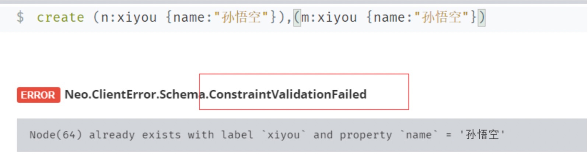

### 3.2.16 DISTINCT
这个函数的用法就像SQL中的distinct关键字，返回的是所有不同值。

```
match (n:`西游`) return distinct(n.name)
```

## 3.3 常用函数
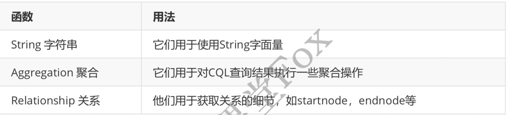

### 3.3.1 字符串函数
与SQL一样，Neo4J CQL提供了一组String函数，用于在CQL查询中获取所需的结果。
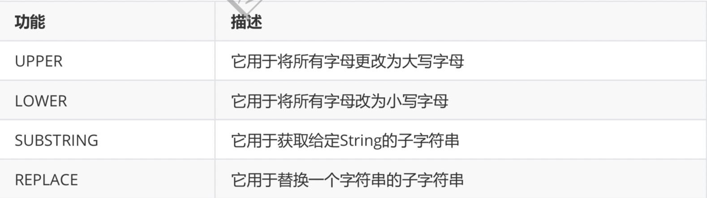

```
MATCH (e) RETURN id(e),e.name,substring(e.name,0,2)
```
### 3.3.2 AGGREGATION聚合
和SQL一样，Neo4j CQL提供了一些在RETURN子句中使用的聚合函数。它类似于SQL中的GROUP BY子句。
我们可以使用MATCH命令中的RETURN +聚合函数来处理一组节点并返回一些聚合值。
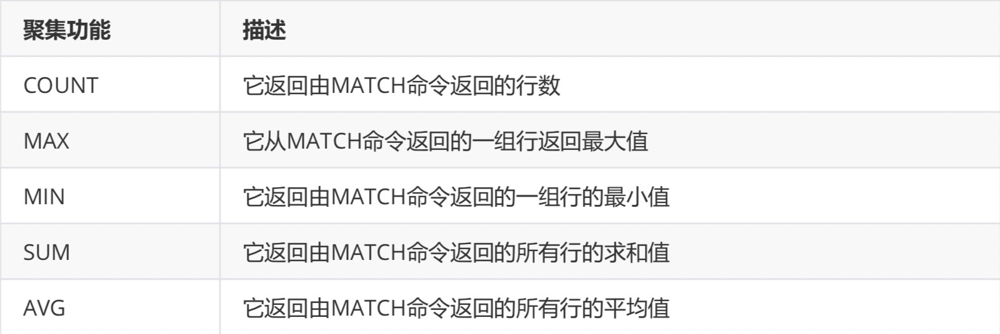

```
MATCH (e) RETURN count(e)
```
### 3.3.3 关系函数
Neo4j CQL提供了一组关系函数，以在获取开始节点，结束节点等细节时知道关系的细节。
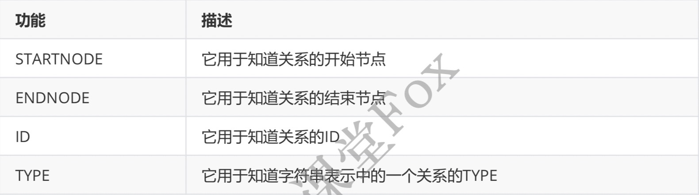

```
match (a)-[r] ->(b) return id(r),type(r)
```
## 3.4 neo4j-admin使用
### 3.4.1 数据库备份
对Neo4j数据进行备份、还原、迁移的操作时，要关闭neo4j。

```
cd %NEO4J_HOME%/bin 
#关闭neo4j
neo4j stop
#备份
neo4j-admin  dump --database=graph.db --to=/neo4j/backup/graph_backup.dump
```
### 3.4.2 数据库恢复
还原、迁移之前 ，要关闭neo4j服务。

```
#数据导入
neo4j-admin load --from=/neo4j/backup/graph_backup.dump --database=graph.db -- force
#重启服务
neo4j start
```
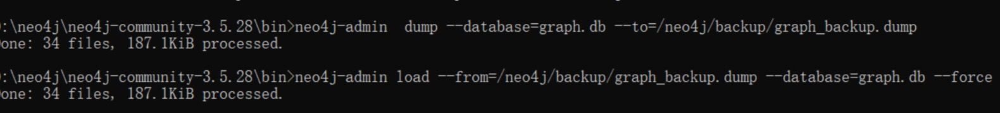

## 3.5 利用CQL构建明星关系图谱

```
#导入明星数据
load csv from 'file:///明星1.csv' as line
create (:star {num:line[0],name:line[1]})
load csv from 'file:///明星关系数据1.csv' as line
create (:starRelation {from:line[0],subject:line[1],to:line[2],object:line[3],relation:line[4]})
#查询明星关系
match (n:star),(m:starRelation),(s:star) where n.name='刘烨' and m.subject='刘烨' and s.name=m.object
return n.name,m.relation,s.name
# 创建关系 构建明星关系图谱
match (n:star),(m:starRelation),(s:star) where n.name='刘烨' and m.subject='刘烨' and s.name=m.object
create (n)-[r:关系{relation:m.relation}]->(s)
return n.name,m.relation,s.name
#查看明星关系
MATCH p=(n:star{name:'刘烨'})-[r:`关系`]->() RETURN p
```

# 4.Spring Boot整合neo4j
## 4.1 spring-data-neo4j
版本:springboot 2.3.5 spring-data-neo4j:5.3.5
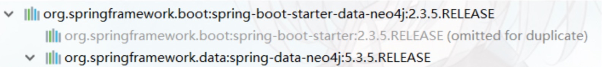

[https://docs.spring.io/spring-data/neo4j/docs/5.3.5/reference/html/#getting-started](
https://docs.spring.io/spring-data/neo4j/docs/5.3.5/reference/html/#getting-started)
## 4.2 添加neo4j依赖

```
<dependency>
    <groupId>org.springframework.boot</groupId>
    <artifactId>spring-boot-starter-data-neo4j</artifactId>
</dependency>
```
## 4.3 添加配置
(注意:不同版本依赖配置可能不一样)，可通过neo4j自动配置类查看

```
# neo4j配置
spring.data.neo4j.uri= bolt://localhost:7687 spring.data.neo4j.username=neo4j spring.data.neo4j.password=123456
```
## 4.4 创建实体
@NodeEntity:标明是一个节点实体 
@RelationshipEntity:标明是一个关系实体 
@Id:实体主键
@Property:实体属性
@GeneratedValue:实体属性值自增
@StartNode:开始节点(可以理解为父节点）
@EndNode:结束节点(可以理解为子节点)

```
@Data
@Builder
@NodeEntity("person")
public class Person implements Serializable {
    @Id
    @GeneratedValue
    private Long id;
    @Property("name")
    private String name;
}

@Data
@NoArgsConstructor
@RelationshipEntity(type = "徒弟")
public class PersonRelation implements Serializable {
    @Id
    @GeneratedValue
    private Long id;
    @StartNode
    private Person parent;
    @EndNode
    private Person child;
    @Property
    private String relation;
    public PersonRelation(Person parent, Person child, String relation)      {
        this.parent = parent;
        this.child = child;
        this.relation = relation;
    } 
}
```
## 4.5 创建接口继承Neo4jRepository

```
@Repository
public interface PersonRelationRepository extends
Neo4jRepository<PersonRelation,Long> {
}

@Repository
public interface PersonRepository extends Neo4jRepository<Person,Long> {
    /**
    * 查询某个节点的所有子节点 * @param pId
    * @return
    */
    @Query("Match (p:person) -[*]->(s:person) where id(p)={0} return s")
    List<Person> findChildList(Long pId);
    @Query("Match (p:person {name:{0}}) -[*]->(s:person) return s")
    List<Person> findChildList(String name);
    /**
    * 查询当前节点的父节点 * @param name
    * @return
    */
    @Query("Match (p:person) -[*]->(s:person {name:{0}}) return p")
    List<Person> findParentList(String name);
}
```
## 4.6 测试

```
@Autowired
private PersonRelationRepository personRelationRepository;
@Autowired
private PersonRepository personRepository;

@Test
public void testCreate(){
    Person person = Person.builder().name("唐僧").build(); 
    Person person2 = Person.builder().name("孙悟空").build(); 
    Person person3 = Person.builder().name("猪八戒").build(); 
    Person person4 = Person.builder().name("沙僧").build(); 
    Person person5 = Person.builder().name("白龙马").build();
    List<Person> personList = new ArrayList<>(Arrays.asList(
person,person2,person3,person4,person5));
    //保存节点数据
    personRepository.saveAll(personList);
    PersonRelation personRelation = new PersonRelation(person,person2,"徒弟");
    PersonRelation personRelation2 = new PersonRelation(person,person3,"徒弟");
    PersonRelation personRelation3 = new PersonRelation(person,person4,"徒弟");
    PersonRelation personRelation4 = new PersonRelation(person,person5,"徒弟");
    List<PersonRelation> personRelationList = new ArrayList<>(Arrays.asList(personRelation, personRelation2, personRelation3,personRelation4));
    // 保存关系数据
    personRelationRepository.saveAll(personRelationList);
}

@Test
public void testfindById(){
    Optional<Person> byId = personRepository.findById(53L);
    System.out.println(byId.orElse(null));
}

@Test
public void testDeleteRelationShip(){
    // 删除所有person节点 
    //personRepository.deleteAll();
    // 删除所有personRelation关系数据 
    personRelationRepository.deleteAll();
}

@Test
public void testDeletePerson(){
    //personRepository.deleteById(1L);
    personRelationRepository.deleteById(1L);
}
```
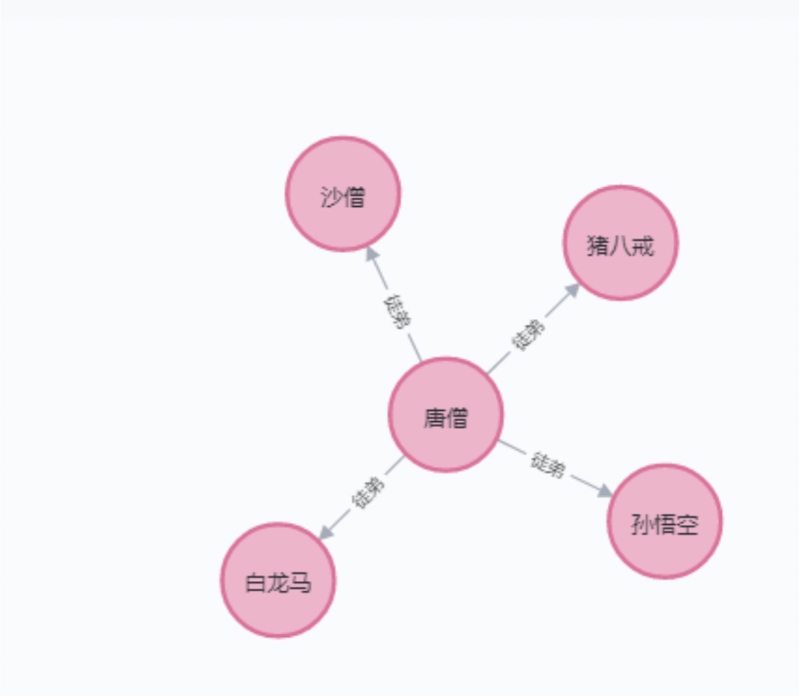
